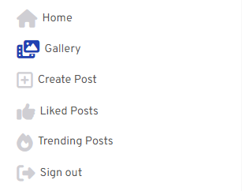
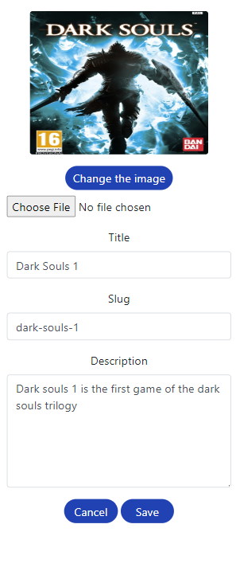
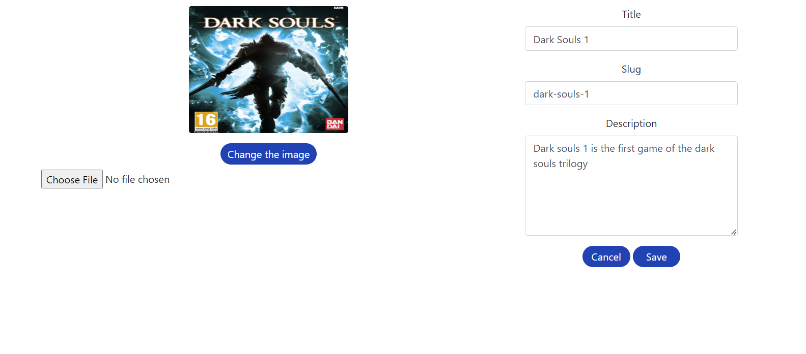
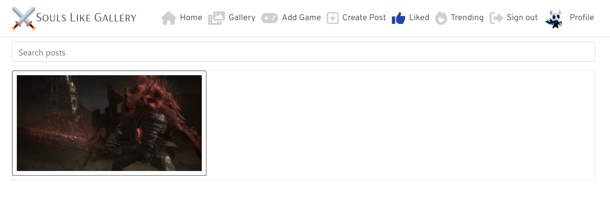

# Souls Like Gallery

Souls Like Gallery is a content sharing application built using a frontend libary called React along with a backend framework called Djanjo Restframework this application will allow users to share there favourite experiences and moments from the souls like genre users will be able to create, read, update and delete records on the application. This is the Frontend development pipeline which showcases how this application was made.

- [Souls Like Gallery](#souls-like-gallery)
    - [CONTENTS](#contents)
    - [UX](#ux)
        - [Strategy Plane](#the-strategy-plane)
            - [Site Goals](#site-goals)
            - [Epics](#epics)
            - [User Stories](#user-stories-list)
        - [Scope Plane](#the-scope-plane)
            - [Features list](#features-list)
        - [Skeleton Plane](#the-skeleton-plane)
            - [Wireframes](#wireframes)
                - [Post Wireframe](#post-wireframe)
                - [Profile Wireframe](#profile-wireframe)
                - [Navigation Bar Wireframe](#navigation-wireframe)
                - [Login Wireframe](#login-wireframe)
                - [Sign up Wireframe](#sign-up-wireframe)
        - [Design plane](#design-plane)
            - [Color Palette](#color-palette)
            - [Typography](#typography)
                - [Headings](#headingss)
                - [Body](#body)
        - [Surface Plane](#surface-plane)
            - [Key Features](#key-features)
                - [Home Page](#home-page)
                    - [Mobile Home page](#mobile-home-view)
                    - [Desktop Home page](#desktop-home-view)
                - [Navigation Bar](#navigation-bar)
                    - [Mobile Navigation View](#mobile-navigation-bar-view)
                    - [Desktop Navigation View](#desktop-navigation-bar-view)
                - [Profile Page](#profile-page)
                    - [Mobile Profile view](#mobile-profile-view)
                    - [Desktop Games view](#desktop-profile-view)
                - [Sign in](#sign-in-page)
                    - [Mobile Sign in view](#mobile-sign-in-view)
                    - [Desktop Sign up view](#desktop-sign-in-view)
                - [Sign up](#sign-up-page)
                    - [Mobile login view](#mobile-sign-up-page)
                    - [Desktop login view](#desktop-sign-up-page)
                - [Gallery](#gallery)
                    - [Mobile Gallery view](#mobile-gallery-view)
                    - [Desktop Gallery view](#desktop-gallery-view)
                - [Posts](#posts)
                    - [Mobile Post Detail view](#mobile-post-detail-view)
                    - [Mobile Add Post view](#mobile-add-post-view)
                    - [Mobile Edit Post view](#mobile-edit-post-view)
                    - [Mobile Delete Post view](#mobile-delete-post-view)
                    - [Desktop Post Detail view](#desktop-post-detail-view)
                    - [Desktop Add Post view](#desktop-add-post-view)
                    - [Desktop Edit Post view](#desktop-edit-post-view)
                    - [Desktop Delete Post view](#desktop-delete-post-view)
                - [Games](#game)
                    - [Mobile Games List](#mobile-games-list)
                    - [Mobile Add Game](#mobile-add-game)
                    - [Mobile Edit Game](#mobile-edit-game)
                    - [Mobile Delete Game](#mobile-delete-game)
                    - [Desktop Games List](#desktop-games-list)
                    - [Desktop Add Game](#desktop-add-game)
                    - [Desktop Edit Game](#desktop-edit-game)
                    - [Desktop Delete Game](#desktop-delete-game)
                - [Liked Post](#saved-post)
                    - [Mobile Liked Posts page](#mobile-saved-posts-page)
                    - [Desktop Liked Posts page](#desktop-saved-posts-page)
                - [Trending](#trending)
                    - [Mobile Trending page](#mobile-trending-page)
                    - [Desktop Trending page](#desktop-trending-pages)
                - [Not found](#not-found)
                    - [Mobile Not found page](#mobile-not-found-page)
                    - [Desktop Not found page](#desktop-not-found-page)
                - [Favicon](#favicon)
                    [Desktop favicon view](#desktop-favicon-view)
    - [Technology](#technology)
        - [Languages](#languags)
            - [Frameworks & Tools](#frameworks--tools)
    - [Deployment](#deployment)
        - [Heroku Deployment](#heroku-deployment)
        - [Running Application locally](#running-application-locally)
        - [Fork Project](#fork-project)
    - [Testing](#testing)
    - [Credits](#credits)
        - [Content](#content)
        - [Code](#code)
    - [Acknowledgements](#acknowledgements)

[To view the deployed project click here](https://souls-like-gallery-03103574fc28.herokuapp.com/)

## UX

### Strategy Plane

#### Site Goals

This site allows users to post there greatest moments from the popular niche genre souls like where they can help inspire others.

* To allow users to join an evergrowing community

* Allowing users to create, read update and delete there own posts and comments

* Allowing users to search for any post by username game title, post content

* Users can give feedback to posts they find useful

#### Epics

I created six Epics which will be turned into User Stories

* Rate Posts interaction [[[#1](https://github.com/mattthughes/souls-like-gallery-app/issues/1)]]

* User Posts [[[#2](https://github.com/mattthughes/souls-like-gallery-app/issues/2)]]

* Post Searching [[[#3](https://github.com/mattthughes/souls-like-gallery-app/issues/3)]]

* User sign in or sign out [[[#4](https://github.com/mattthughes/souls-like-gallery-app/issues/4)]]

* User Profile [[[#5](https://github.com/mattthughes/souls-like-gallery-app/issues/5)]]

* React Project setup [[[#6](https://github.com/mattthughes/souls-like-gallery-app/issues/6)]]

#### User Stories list

1. User Profiles

* UserStory [[#12](https://github.com/mattthughes/souls-like-gallery-app/issues/12)] - As a site user I can view other users profiles so that I can see all there posts

* UserStory [[[#10](https://github.com/mattthughes/souls-like-gallery-app/issues/10)]] - As a logged in user I can edit my profile so that I can change my profile picture and bio

* UserStory [[[#25](https://github.com/mattthughes/souls-like-gallery-app/issues/25)]] - As a site user I can view users avatars so that I can easily identify users of the application

* UserStory [[[#24](https://github.com/mattthughes/souls-like-gallery-app/issues/24)]] - As a site user I can change my profile image so that I can customize my profile to my needs

2. Authentication

* UserStory [[[#9](https://github.com/mattthughes/souls-like-gallery-app/issues/9)]] - As a logged in user I can update my username and password so that I can change my account information and keep my profile secure

* UserStory [[[#31](https://github.com/mattthughes/souls-like-gallery-app/issues/31)]] - As a site user I can sign in to the app so that I can access functionality for logged in users

* UserStory [[[#32](https://github.com/mattthughes/souls-like-gallery-app/issues/32)]] - As a new user I can create a account so that I can access access functionality for logged in users

* UserStory [[[#29](https://github.com/mattthughes/souls-like-gallery-app/issues/29)]] - As a site user I can maintain my logged in status until I choose to log out so that my user experience is not compromised

3. Navigation

* UserStory [[[#26](https://github.com/mattthughes/souls-like-gallery-app/issues/26)]] - As a site user I can navigate through pages quickly so that I can view content seamlessly without page refresh

* User Story [[[#28](https://github.com/mattthughes/souls-like-gallery-app/issues/28)]] - As a site user I can view a navigation bar from every page so that I can navigate easily between pages

* UserStory [[[#27](https://github.com/mattthughes/souls-like-gallery-app/issues/27)]] - As a logged out user I can see sign in and sign up options so that I can sign in/sign up

* UserStory [[[#8](https://github.com/mattthughes/souls-like-gallery-app/issues/8)]] - As a site user I can keep scrolling through the posts on the site that are loaded automatically so that I don't need to refresh or click on a next page button with the posts being loaded automatically

4. Post Interaction

* UserStory [[#21](https://github.com/mattthughes/souls-like-gallery-app/issues/21)] - As a site user I can click on any post and see the description comments and likes so that I can join in on the conversation and learn more about the post

* UserStory [[[#11](https://github.com/mattthughes/souls-like-gallery-app/issues/11)]] - As a site user I can view all the posts by a specific user so that I can catch up on there latest posts

* UserStory [[[#22](https://github.com/mattthughes/souls-like-gallery-app/issues/22)]] - As a post owner I can edit my post content and image** so that I can make changes to my post after it was created

* UserStory [[[#23](https://github.com/mattthughes/souls-like-gallery-app/issues/23)]] - As a logged in user I can create a post so that I can share my favourite moments via image with others

5. Comment Interaction

* UserStory [[[#18](https://github.com/mattthughes/souls-like-gallery-app/issues/18)]] - As a logged in user I can read comments on posts so that I can what other users think of posts When the post is clicked comments to load Comments to show on specific post

* UserStory [[[#16](https://github.com/mattthughes/souls-like-gallery-app/issues/16)]] - As a comment owner I can edit my comment so that I can fix or update my existing comment

* UserStory [[[#20](https://github.com/mattthughes/souls-like-gallery-app/issues/20)]] - As a logged in user I can leave a comment for posts I enjoy so that I can share my thoughts with others

* UserStory [[[#17](https://github.com/mattthughes/souls-like-gallery-app/issues/17)]] - As an owner of a comment I can delete my own comment so that I can delete comments I do not find useful

* UserStory [[[#19](https://github.com/mattthughes/souls-like-gallery-app/issues/19)]] - As a site user I can see how long ago a comment was made so that I know how old a comment is

6. Post Feedback

* UserStory [[[#15](https://github.com/mattthughes/souls-like-gallery-app/issues/15)]] - As a logged in user I can like a post so that I can show support for posts that interests me

* UserStory [[[#14](https://github.com/mattthughes/souls-like-gallery-app/issues/14)]] - As a logged in user I can unlike a post so that I can remove accidental likes

* UserStory [[[#7](https://github.com/mattthughes/souls-like-gallery-app/issues/7)]] - As a site user I can like posts so that I can look back on posts that have been memorable and useful

7. Trending Posts

* UserStory [[[#13](https://github.com/mattthughes/souls-like-gallery-app/issues/13)]] - As a logged in user I can view trending posts so that I can view the most popular posts on the application

### The Scope Plane

#### Features List

* Posts - Users can search for posts by the users name content of the post or the game title, users can also create, read update and delete there own posts
* Profile - Users can search for any user and view there posts and attachments such as linkedin link, they can also create, read, update and delete there own profile
* Likes and Comments - Users can leave likes and comments on posts they find useful providing they are logged in, users can create,read update, delete there own likes and comments
* Log in and Out - Users can logout of there account to keep there information secure, users can change passwords,
* Games - Users can view the games list which is shown on the post create page, games can be created, edited and deleted by the admin user only. If another user tries to access this page the not found page will load.
* Trending - Users can view the trending list which will dynamically change depending on the amount of likes, this page will show a maximum of 10 posts.

### The Skeleton Plane

#### Wireframes

##### Post Wireframe

##### Profile Wireframe

##### Navigation Wireframe

##### Login Wireframe

##### Sign up Wireframe

## Design Plane

### Color Palette

I have decided to go for this color palette as all the colors flow well together and creates a professional design

## Typography

### Headings

I have decided to go for the Arsenal SC font heading I chose to go for this as it stands out compared to the other text on the application and makes the application look very professional.

### Body

I went for the OverPass font family for all other text on the application such as post content, comments and navigation font as this keeps the professional look I am going for on this application.

## Surface Plane 

### Key features

#### Home Page

This page upon loading will explain to the user how to create an account how to create a post, and a bit of a background around what the application is designed for, the user is then able to click either the Sign in or sign up button depending if they have an account already. The navigation bar component was reused to have the same navigation bar on all pages.

##### Mobile Home view

##### Desktop Home view

#### Navigation Bar

This page will use conditional rendering to determine which pages are displayed in the navigation bar for users that are not logged in, The home page, sign up and sign pages will be visible locking certain features away from users that aren't logged in. Once the user logs in, the Navigation bar will change now highlighting the following pages, Home, Gallery, Profile, Trending, Saved, Sign out, Add Post. This feature will collapse on mobile and stretch for desktops as well. I did not reuse a component for this feature.

##### Mobile Navigation Bar view

`Navbar logo`

`Navbar not logged in`

`NavBar logged in Admin`

`NavBar logged in User`

##### Desktop Navigation Bar view

`Navbar not logged in`

`NavBar logged in Admin`

`NavBar logged in User`

#### Profile Page

This page will showcase the users avatar image there username and also there posts each user will have a profile page which will be clickable, allowing users to view all the posts a specific user has posted. The post detail component was reused on this page to match the post detail view on all other pages to make sure each dataset matched. I reused the profile edit form component which would dynamically update depending on what was edited allowing the user to be notified in real time rather than waiting for the page to refresh with the new data. The navigation bar component was reused to have the same navigation bar on all pages.

##### Mobile Profile view

`Mobile profile owner`

`Mobile not the profile owner`

`Mobile Profile has posts`

`Mobile Profile zero posts`

##### Desktop Profile view

`Desktop Profile owner`

`Desktop not the profile owner`

`Desktop profile has posts`

`Desktop Profile zero posts`

#### Sign in Page

This feature will allow users to log in to an existing account to gain access to the applications features such as creating posts, leaving comments and likes. The navigation bar component was reused to have the same navigation bar on all pages.

##### Mobile Sign in view

##### Desktop Sign in view

#### Sign up page

This feature will highlight three features username password and confirm password upon a user entering these details providing the data entered is correct the user will be redirected to the login page with a message stating account created. The navigation bar component was reused to have the same navigation bar on all pages.

##### Mobile Sign up page

##### Desktop Sign up page

#### Gallery

This Page will showcase many different posts but not in detail showing just the image or video of the post if a user wishes to find out more information regarding a post then the user can just click on the post image or video which will load the post detail. I reused the post component which would show the post image, the user could view the post detail upon clicking on the image which would reuse the post detail component, this was done to make sure the user could simultaneously go from the gallery page to the post detail view there is a button stating back to gallery if the user wishes to redirect improving the user experience. The navigation bar component was also reused to have the same navigation bar on all pages.

##### Mobile Gallery view

##### Desktop Gallery view

#### Posts

This feature will be the primary feature of the application allowing users full creative control to create read update and delete there own posts, users are able to create a post attach either a video or image depending on what suits there needs. Users will be able to edit there own posts and delete posts while also being able to read other user posts they find useful. The navigation bar component was reused to have the same navigation bar on all pages. The post detail component was reused on the specific posts id which will be dynamically changed depending on which post is selected, this will save time in development meaning each dataset matches from the post create and edit form. I also reused the comments component here which would be using the comment create and edit form which would update in real time without refreshing the page providing a better user experience for the user. The comments would be linked to the specific post upon deletion informing the user that there comment had been deleted.

##### Mobile Post Detail view

##### Mobile Add Post view

##### Mobile Edit Post view

##### Mobile Delete Post view

##### Desktop Post Detail view

##### Desktop Add Post view

##### Desktop Edit Post view

##### Desktop Delete Post view

#### Games

This feature will be updated by the admin user who can create,edit,delete games. These will be linked to the post as well allowing a user to search for a specific game. I reused the game component for the game create and edit form which would showcase the games list so this could be updated dynamically and the two datasets linked together, The navigation bar component was reused to have the same navigation bar on all pages. I also reused the game detail component on the games detail view which will allow a user to keep updated about a game, this was reused as this will keep track of the game dataset which will dynamically update after using the game create, edit form.

##### Mobile Games List

##### Mobile Add Game

##### Mobile Edit Game

##### Mobile Delete Game

##### Desktop Games List

##### Desktop Add Game

##### Desktop Edit Game

##### Desktop Delete Game

#### Liked Post

This feature will allow users to click like on a specific post they find useful or would like to look at again in the future, Once the user clicks on the liked page this page will load all the posts that a user has liked only showing them there posts and not others. I reused the post component which is using the gallery view I did this as the overall design was very simplistic again allowing a user to click on the post to view the detailed post, if they would like to as I was keeping the same design as the gallery page which is why I reused the post component rather than the post detail component. The navigation bar component was reused to have the same navigation bar on all pages.

##### Mobile Liked Posts page

##### Desktop Liked Posts page

#### Trending

This feature will be updated dynamically depending on the post likes the post with the most likes will appear at the top of the page this page will show a maximum of 10 pages. I did not reuse a component for this as the get requests were different than the standard gallery page. The navigation bar component was reused to have the same navigation bar on all pages.

##### Mobile Trending page

##### Desktop Trending page

#### Not Found

This feature will be shown if the user tries to visit a page that does not exist or if they do not have the required permissions to access the requested page. The navigation bar component was reused to have the same navigation bar on all pages.

##### Mobile Not found page

##### Desktop Not found page

#### Favicon

This feature will be present alongside the title of the application I decided with a simple two swords design as the design is very simplistic and can be very memorable and also matches the theme of the application.

##### Desktop Favicon view

## Technology

### Languages

* HTML
* CSS

### Frameworks & Tools

- [react](https://react.dev/)
- [react-bootstap](https://react-bootstrap.netlify.app/)
- [react infinite scroll](https://www.npmjs.com/package/react-infinite-scroll-component)
- [react toastify](https://www.npmjs.com/package/react-toastify)
- [axios](https://www.npmjs.com/package/axios)
- [JS Hint](https://jshint.com/)
- [CSS validator](https://jigsaw.w3.org/css-validator/)
- [Wave report](https://wave.webaim.org/)
- [Coolors](https://coolors.co/)
- [Git](https://git-scm.com/)
- [Github](https://github.com/)
- [Heroku](https://dashboard.heroku.com/apps)
- [Am I Responsive](https://ui.dev/amiresponsive)

## Deployment

This application was created using GitPod and was then pushed to GitHub to the respository called [souls-like-gallery-app]((https://github.com/mattthughes/souls-like-gallery-app))

To make sure I was able to keep updated with the changes I used the following git commands:

git add- This command was used to add the changes to the staging area before changes are commited.

git commit -m "message"- This command was used to add the changes to the repository queue.

git push - This command pushes all the commited code in the repository queue to Github.

### Heroku Deployment

`Creating the react app`

* Use the command npx create-react-app . --use-npm
* Once this is done use the npm start command to start the app where the compliler will launch depending if there are any errors

`Heroku Deployment`

1. Log in to heroku or set up an account
2. From the dashboard click create new app
3. Give the app a unique name
4. Select the region closest to you and select create app
5. Once the app is created connect your github repository to ensure your changes on the development server is up to date with the deployed project
6. Click deploy and wait for the project to build
7. Once built click the open app button which will load the deployed app

### Running Application Locally

Navigated to the GitHub Repository:

1. Click on the code drop down and click on HTTPS
2. Copy the Repository link to the clipboard
3. Open your IDE such as GitPod, CodeAnywhere or any of your choosing making sure git is also installed
4. Type git clone alongside the repository link you have just copied into the IDE terminal, the project will now be cloned for use.

### Fork Project

### Fork Project

1. Log in or sign u to GitHub.
2. Go to the repository for this project [mattthughes/souls-like-gallery-app](https://github.com/mattthughes/souls-like-gallery-app)
3. Click the Fork button on the right corner to fork the project.

## Testing

I Tested this project extensively making sure each element worked as intended and had the desired result while also checking that there were no errors all testing documentation can be found [here](https://github.com/mattthughes/souls-like-gallery-app/blob/main/TESTING.md)

## Credits

### Content

* Dark Souls 1 description found [here](https://en.bandainamcoent.eu/dark-souls/dark-souls#:~:text=Dark%20Souls%20is%20the%20new,encounters%20and%20unique%20online%20interactions.)
* Dark Souls 2 description found [here](https://en.bandainamcoent.eu/dark-souls/dark-souls-ii#:~:text=Dark%20Souls%20II%20brings%20the,only%20FROM%20SOFTWARE%20can%20deliver.)
* Dark Souls 3 description found [here](https://en.wikipedia.org/wiki/Dark_Souls_III#:~:text=Dark%20Souls%20III%20is%20a,the%20end%20of%20the%20world.)
* Bloodborne description found [here](https://www.fromsoftware.jp/ww/detail.html?csm=094#:~:text=Game%20Summary,the%20mysterious%20world%20of%20Bloodborne.)
* Elden Ring description found [here](https://en.wikipedia.org/wiki/Elden_Ring#:~:text=Elden%20Ring%20takes%20place%20in,tree%20that%20empowers%20the%20inhabitants.)
* Sekiro shadows die twice description found [here](https://www.sekirothegame.com/#:~:text=In%20Sekiro%3A%20Shadows%20Die%20Twice,including%20the%20dangerous%20Ashina%20clan.)
* Demon's Souls description found [here](https://en.wikipedia.org/wiki/Demon%27s_Souls#:~:text=Demon's%20Souls%20is%20an%20action,(stats)%20related%20to%20gameplay.)
* All other content written by Matthew Hughes

### Code

* Front End application has been influenced by the moments walkthrough project and has been adjusted and customised to fit my projects needs including post create edit and delete functionality. The use redirect hook, user context hook, the comment component which involves full CRUD functionality, the likes component, Drop down component and the profiles page basic structure, Navigation bar testing can be found [here](https://github.com/mr-fibonacci/moments)

### Imagery

- Demons souls game image found [here](https://www.imdb.com/title/tt12507852/)
- Dark Souls 1 game image found [here](https://darksouls.fandom.com/wiki/Dark_Souls)
- Dark Souls 2 game image found [here](https://www.twitch.tv/directory/category/dark-souls-ii-scholar-of-the-first-sin)
- Dark Souls 3 game image found [here](https://www.reddit.com/r/steamgrid/comments/l4kjuz/dark_souls_trilogy_and_sekiro/)
- Bloodborne game image found [here](https://www.tradeinn.com/techinn/en/playstation-ps4-bloodborne-ps-hits/137522170/p)
- Sekiro game image found [here](https://www.mobygames.com/game/113492/sekiro-shadows-die-twice/cover/group-186461/
cover-547410/)
- Elden Ring game image found [here](https://store.bandainamcoent.eu/)
- Sekiro post image found [here](https://www.imdb.com/title/tt8558306/)
- Irithly post image found [here](https://www.reddit.com/r/darksouls3/comments/stoeqv/irithyll_of_the_boreal_valley_appreciation_post/)
- Ornstein and Smough image found [here](https://www.thegamer.com/dark-souls-ornstein-smough-boss-battle-strategy-tips/)
- Demons souls post found [here](https://www.youtube.com/watch?v=Xf4wmN0u8S8)
- Consort Radahn post image found [here](https://www.thegamer.com/elden-ring-new-game-plus-radahn-boss-battle/)
- Messmer post image found [here](https://www.youtube.com/watch?v=QdRhysTPMy8)
- Ludwig bl4 post image found [here](https://www.youtube.com/watch?v=BpG6Rz1Nhoc)
- Firelink shrine post image found [here](https://www.polygon.com/dark-souls-remastered-guide/2018/6/5/17425250/firelink-shrine-map)
- Majula post image found [here](https://medium.com/@Rain66/how-to-enjoy-gaming-again-3-tips-1c34edff65fe)
- Slave Knight Gael post image found [here](https://villains.fandom.com/wiki/Knight_Artorias)
- Malenia RL1 post image found [here](https://www.youtube.com/watch?v=Rt6UlUYPUVI)

## Acknowledgements

* I would like to thank my mentor dick which helped me with the project, the code institute tutors were incredibly helpful with understanding errors and why they were happening
* I would like to thank my family and friends which helped test key features during development which assisted me with bug fixes